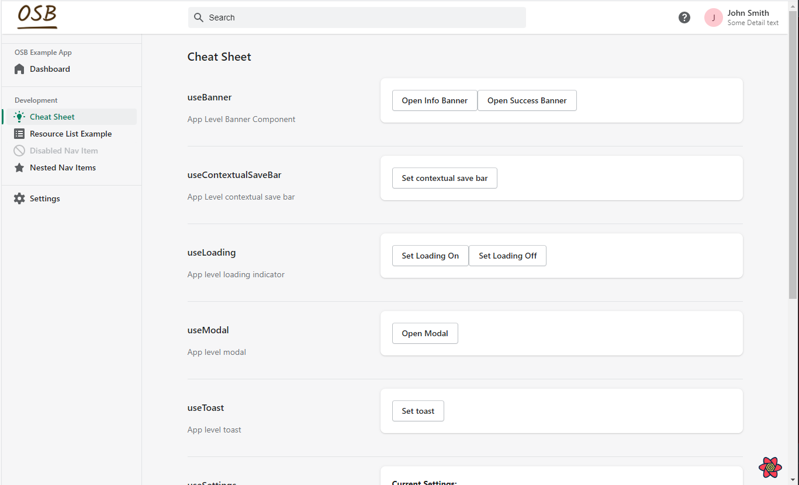

# Demo

## [Check Out The Docs!](https://michaelgibbons.info/OSB/#/)

##  A full featured, production ready Shopify application with all the development utilities you could want!

##  Client Side Routing?!

##  A Skeleton page loading component?

##  Prebuilt shop level settings?! Wow!

##  Integrated React-query dev tools!

##  Comprehensive client and server side logging for development AND production?! I may faint.

##  Even a cheat sheet so developers don't have to keep referencing the documentation, how dreamy.

