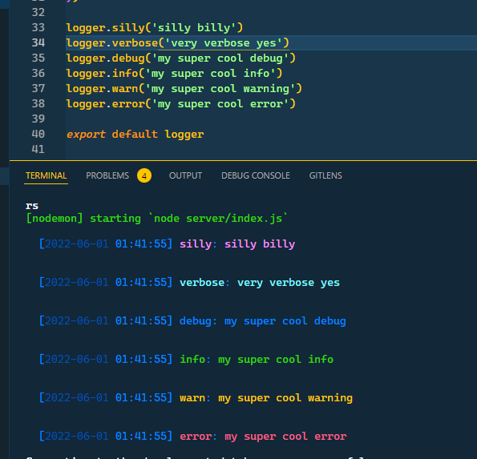
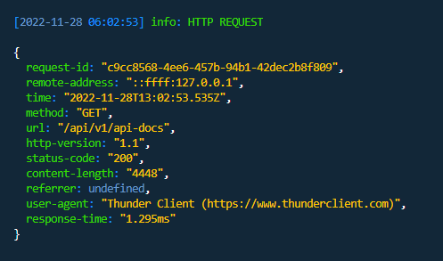

# Logging

Logs are your friends.

Logs. are. your. friends.

!> Hint: Logs are your friends

There are so many bugs I would have been able to fix sooner and with less headache if I had just simply put in the extra effort to log actions occurring in my applications.

Log everything within reason. Luckily I've done most of the work for you. You just have to sit back and reap the benefits.

## Winston

This template uses the very popular [winston](https://github.com/winstonjs/winston) package to handle logs.

I have created 2 loggers, 1 for development, and 1 for production. Deciding which to use is handled by the logging service located at `/web/backend/services/logger`, all you need to do is import it.

### Development Logging

The shopify cli consumes all terminal coloration so I created a logging script which is run concurrently with the `dev` script, then from the development logger those logs are sent to a `log.log` file in the root directory. 10 times a second that file is compared to the previous log file, `log-old.log`. The differences between these files are then logged and the log files are updated accordingly.

What this allows me to do is use another package I've developed, [json-chalkify](https://www.npmjs.com/package/json-chalkify), to colorize and print logs in a more readable format outside the shopify cli context.

### Production Logging

If the `NODE_ENV` environment variable is not set to `development`, the logs will be sent to logtail instead. This is why we needed the `LOGTAIL_SOURCE_TOKEN` environment variable.

## Backend Logging

Why even log things anyway? What's the point?

Sometimes, most of the time, (every time), you will not have access to all the information you need to debug an issue. By logging every step in a process, you are able to see exactly when and where an error happened, and what data caused it to error. Which is infinitely more useful that interpreting the error message and praying your fix worked.

### HTTP Request Logging

This template uses the very popular package [morgan](https://www.npmjs.com/package/morgan) to pass http request data to our logger service.

Every single request that hits our server will be assigned a unique `requestId`

### Database Query Logging

Every single database action prisma performs will be logged as long as you are using the prisma client defined in `/web/backend/prisma/index.js`

### Redis Logging

Every single redis job event `progress`, `completed`, `failed`, `error` will be logged. Along with their corresponding shopify session and request id.

### App Startup Logging

Certain actions performed on app startup are logged. When you go through auth, the registered webhooks will be logged. Also all registered routes on your express app will be logged

### Logging everything else

Using the `logger` service you can log anything you want! See the [winston](https://github.com/winstonjs/winston) documentation for usage examples.

## Frontend Logging

The frontend is not safe from errors either, when your frontend application crashes you do not have a product, so you need to know if/when that happens.

The frontend has a useful hook called `useLogger` which is covered in the frontend section.

All this hook does is create the same utilities we were using on the backend and sending it to a `/log` endpoint to be properly logged by our logging service.

### App Crash Errors

This template uses [react-error-boundary](https://www.npmjs.com/package/react-error-boundary), which means when your application errors it will display a fallback UI. A UUID is created and passed to the logging service in this scenario for diagnostic purposes.

### Request Failure Errors

This template has the useful hooks `useAppQuery` and `useAppMutation` which are wrappers around [react-query's](https://react-query-v3.tanstack.com/guides/queries) hooks which toggle the application loading state, ensure authentication, and (you guessed it) log an error object when a query or mutation fail.