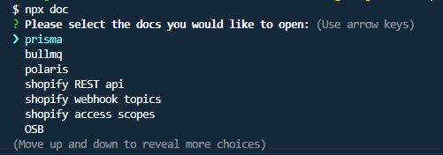

# Introduction and Motivation

?> This is a Shopify App Boilerplate aimed at Intermediate to Advanced developers, if you are a beginner you will likely find this template too complex. However if you have the hutzpah to learn the concepts behind this template, you will advance much quicker than I did.

Shopify is a large company that has clients using a very diverse set of technical tools. As such if they want to make developer tools, they are forced to make them unopinionated to account for a very wide variety of uses. This forces developers to reinvent the wheel so-to-speak to make relatively simple full stack applications.

Luckily I am just a guy, so I have no such obligations.

This template has everything one could need for a production ready application. Also since it is a template and not a package, **You own all the code**. There are no hidden resources, if you don't like how something works, by all means change it!

If there is an unforeseen bug in the template, you don't have to wait on me to fix it, since you have all the source code necessary to fix it yourself in a pinch. (Please do create a bug report though!)

# Required Resources

## Postgres

This template uses [prisma](https://www.prisma.io/) as its ORM. Postgres was chosen as the database dialect.

Because of this you will need a local Postgres server and database. If you need help setting this up, please see [prisma's documentation](https://www.prisma.io/dataguide/postgresql/setting-up-a-local-postgresql-database)

## Redis

All full stack applications worth their salt should be using redis. Redis is a key:value pair storage system used primarily for caching data and creating jobs/workers.

This template uses [bullmq](https://docs.bullmq.io/) as its job queuing manager.

Because of this you will need a local redis server. If you need help setting this up, please see [redis' documentation](https://redis.io/docs/getting-started/installation/)

The setup is straight forward on most operating systems but can be a little tricky on Windows specifically, here is a [helpful video](https://www.youtube.com/watch?v=_nFwPTHOMIY) made by redis to guide you during the installation process.

## Logtail Source Token

This template uses [logtail](https://betterstack.com/logtail) to handle production logging. Most applications should fall under the free tier. Once the app goes to production you will likely want a longer retention storage time for your logs, which is not free, but Logtail's prices are very reasonable.


# Installation

To create a new shopify app using this template, simply run the command:

```
npm init @shopify/app@latest -- --template=https://github.com/Michael-Gibbons/OSB
```

Then run the following command to install all required dependencies and register the app with shopify.

```
npm run dev
```

# Helpful Commands!

This template uses a lot of 3rd party open source packages to handle different aspects of the application. You will likely need to reference a lot of different documentation during the development process.

Because of this I made this simple package, [doc-me](https://www.npmjs.com/package/@michael.gibbons/doc-me). In the root of your application run:

```
npx doc
```

To get a list of all documentation used in this project. Selecting one will open the documentation in a new tab using your default browser.



These urls are defined in the root `package.json` file, feel free to add your own as your project grows.

# Donate

Everything I make under my name will be free, always.

But if you want to buy me a coffee I'm not going to refuse.

[Buy me a Coffee](https://www.buymeacoffee.com/michaelgibbons1) :heart: